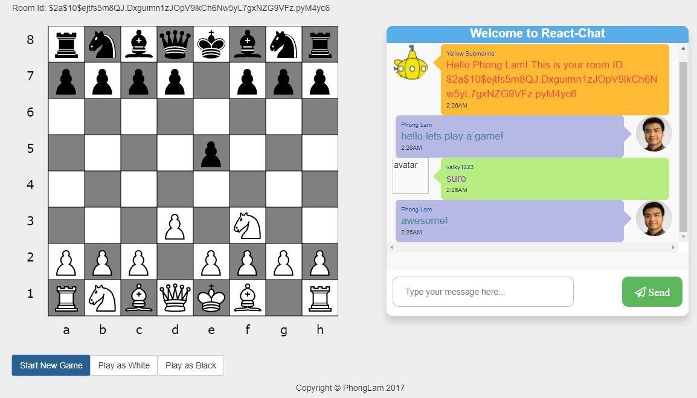

## React-Chess with Phong

Link: https://deep-subs.herokuapp.com/

#Table of Contents

1. [Requirements](#requirements)
2. [Development](#development)
    1. [Steps to start](#Steps to start)
    1. [Things to do](#Things to do)

## Requirements

- Node 8.1.4
- Postgresql 9.6.x

## Development

# Steps to start:
1. npm install to install dependencies.
2. npm start: will run web-pack-dev server (on localhost:3000)
3. Happy coding!

You will need to create a .env file with these fields  
DATABASE_LOCAL  
DATABASE_URL  
FB_ID  
FB_SECRET  
FB_CALLBACK  
GOG_ID  
GOG_SECRET  
GOG_CALLBACK  
REDIS_URL  

# Database:
You will need to have a local or cloud hosted PostgreSQL database.  
In terminal from root directory run:  
- knex migrate:latest --env NODE_ENV
- knex migrate:rollback --env NODE_ENV

Modify the database with other schemas as you see fit. Right now there is only a basic users schema.

# Overview:
- Real time chess with friends!
- Unique room ID per session
- Chessboard rendered using React-Chessdiagram module
- Move validation using Chess.js module
- Basic AI implemented using minimax algorithm
- AI calculations are being done server side and client inputs are being handled through React/Redux for better user experience
- Utilize React/Redux for component's reusability (States are almost entirely in Redux store)
- Build with Bootstrap and custom CSS for responsive front-end interface
- front-end routing using React Router Dom V.4
- Passport.JS for Oauth 2.0 authentication standard
- Engineer SocketIo communication with Express.JS to achieve real time communication between client-server
- PostgreSQL in conjunction with Knex.JS as the main DB storage mechanism
- App is deployed on Heroku!

# Things to do:
- Improve UI interface
- Chess AI engine(done!)
- Improve chess AI further
- Ability to invite friends through social media
